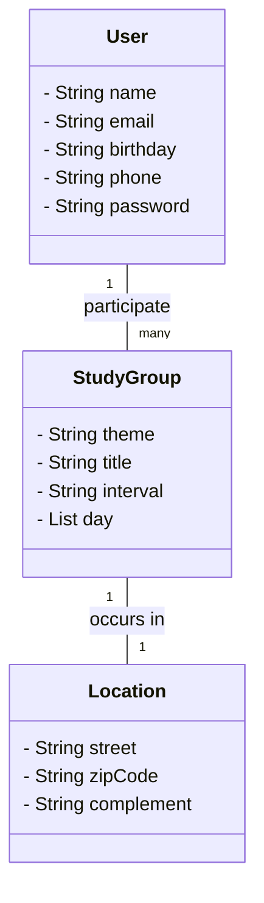

# Projeto Aktie - Compartilhar conhecimento

Diagrama de classe do projeto:

---

# Protótipo

Link do [protótipo](https://marvelapp.com/prototype/h435694)

---

# Tecnologias utilizadas

### Documentação

Para mais referências, acessar os links abaixo:

* [Official Gradle documentation](https://docs.gradle.org)
* [Spring Boot Gradle Plugin Reference Guide](https://docs.spring.io/spring-boot/3.4.4/gradle-plugin)
* [Create an OCI image](https://docs.spring.io/spring-boot/3.4.4/gradle-plugin/packaging-oci-image.html)
* [Spring Web](https://docs.spring.io/spring-boot/3.4.4/reference/web/servlet.html)
* [Spring Data JPA](https://docs.spring.io/spring-boot/3.4.4/reference/data/sql.html#data.sql.jpa-and-spring-data)