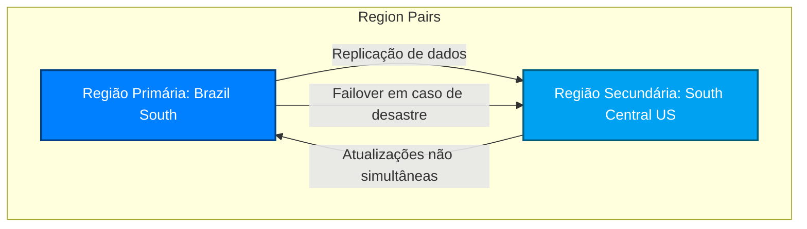

## Regiões

As regiões são compostas por um ou mais (normalmente 3) datacenters muito próximos, eles se comunicam entre si com o backbone da Azure para garantir resiliência em caso de um desastre em um datacenter. Eles fornecem flexibilidade e escala para reduzir a latência do cliente. As regiões preservam a residência dos dados com uma oferta abrangente de conformidade.

O Azure oferece mais regiões globais do que qualquer outro provedor de nuvem, com mais de 60 regiões representando mais de 140 países.


[Globo com as regiões da Azure](https://datacenters.microsoft.com/globe/explore?view=globe)

---

## Zonas de Disponibilidade - AZ (Availability Zone)

São locais físicos separados dentro de uma mesma região da Azure, cada uma com sua própria infraestrutura de energia, refrigeração e rede. O objetivo é garantir alta disponibilidade e resiliência contra falhas locais.

Ao distribuir suas aplicações e dados entre múltiplas zonas, você protege seus sistemas contra:

- Falhas de data center
- Problemas de energia ou rede localizados
- Interrupções regionais parciais

Cada região da Azure pode conter duas ou mais zonas, permitindo configurar soluções tolerantes a falhas, com SLA de até **99,99%** de disponibilidade para serviços compatíveis.


**Podemos dizer que uma AZ é um datacenter?**

Nem sempre podemos dizer que uma AZ (Availability Zone) é exatamente um datacenter, mas... cada AZ é composta por, no mínimo, um ou mais datacenters distintos.

- Uma AZ é uma "zona lógica de disponibilidade" dentro de uma região da Azure.
- Fisicamente, ela é implementada com **um ou mais datacenters independentes**, cada um com infraestrutura própria (energia, refrigeração, rede, segurança etc.).
- Essas zonas são geograficamente separadas umas das outras (geralmente com vários quilômetros de distância), mas conectadas por uma rede de alta velocidade e baixa latência.

Em resumo:
- Toda AZ tem pelo menos um datacenter.
- Mas nem todo datacenter é, necessariamente, uma AZ.
- Às vezes, uma única AZ pode conter mais de um datacenter para escalar ou redundância interna.

---

## Pares de Região

A Azure organiza suas regiões em pares, chamados de Region Pairs, para oferecer:

- Alta disponibilidade
- Recuperação de desastres (Disaster Recovery)
- Redundância geográfica
- Atualizações coordenadas com menor impacto

### Como funciona um par de região?

Cada região da Azure (ex: *Brazil South*) é emparelhada com outra dentro da mesma área geopolítica (sempre que possível). Isso quer dizer que:

- As duas regiões do par não compartilham a mesma infraestrutura física.
- Elas estão separadas por distância suficiente para evitar falhas simultâneas, mas próximas o bastante para permitir replicação síncrona de dados (quando aplicável).
- A Microsoft garante que atualizações de manutenção sejam aplicadas em momentos diferentes entre as duas regiões do par, para evitar downtime simultâneo.

### Benefícios de usar region pairs:

| Benefício | Descrição |
|----------|-----------|
| Continuidade de negócios | Se uma região falhar, a outra pode assumir as cargas críticas. |
| Replicação automática | Recursos como Azure Storage, SQL, e Geo-Redundant Storage (GRS) são replicados entre as regiões do par. |
| Atualizações coordenadas | Manutenções planejadas são feitas de forma independente entre as regiões. |
| Compliance | Mantém dados na mesma região geopolítica (ex: dentro do Brasil ou da União Europeia). |

Exemplos de pares:

| Região primária | Região emparelhada |
|-----------------|---------------------|
| Brazil South    | South Central US    |
| East US         | West US             |
| North Europe    | West Europe         |
| Southeast Asia  | East Asia           |

Se estiver arquitetando soluções resilientes na Azure, usar **Region Pairs** junto com **Availability Zones** é uma das melhores práticas para tolerância a falhas e continuidade de negócios.



### Zonas soberanas

Zonas soberanas da Azure são instâncias isoladas da nuvem da Microsoft, projetadas para atender a requisitos específicos de soberania de dados, segurança e conformidade de governos e entidades públicas. 

Elas operam separadamente da nuvem pública da Azure e são mantidas por parceiros locais autorizados, garantindo que os dados permaneçam dentro das fronteiras nacionais e sob controle exclusivo das autoridades locais. 

Exemplos incluem Azure Government nos Estados Unidos, que atende a orgão militares e governamentais dos EUA e a Azure China, operada pela 21Vianet.

---

## Grupos de Recursos

São contêineres lógicos na Azure que armazenam e organizam os recursos de uma aplicação, como máquinas virtuais, redes, bancos de dados, contas de armazenamento, entre outros. Eles facilitam o gerenciamento, a implantação e a governança de recursos que compartilham o mesmo ciclo de vida.


Veremos a seguir sobre **Subscriptions** e **Management Group**.

### Principais características

- **Organização lógica:** Permitem agrupar recursos relacionados, tornando a estrutura do ambiente mais clara e gerenciável.
- **Gerenciamento centralizado:** É possível aplicar políticas, controle de acesso (RBAC), tags e monitoramento de forma centralizada.
- **Implantação em conjunto:** Recursos dentro do mesmo grupo podem ser implantados, atualizados ou excluídos em conjunto.
- **Localização:** Embora os recursos possam estar em diferentes regiões, o grupo em si possui uma localização, utilizada para armazenar metadados.

### Boas práticas

- Agrupar recursos que compartilham o mesmo ciclo de vida (por exemplo, os componentes de uma aplicação específica).
- Utilizar convenções de nomenclatura e tags para facilitar a identificação e automação.
- Evitar misturar recursos de ambientes distintos (como produção e desenvolvimento) no mesmo grupo.

### Casos de uso

- Criar um grupo de recursos para todos os serviços de uma API web.
- Separar os recursos de diferentes clientes ou departamentos.
- Automatizar a limpeza de ambientes de testes ao excluir o grupo de recursos.

---

## Assinaturas (Subscriptions)

Claro! Aqui está uma pequena documentação introdutória sobre **Assinaturas** na Azure:

---

## Assinaturas na Azure

Assinaturas (Subscriptions) na Azure representam uma unidade de cobrança e controle de acesso aos recursos em nuvem. Cada assinatura possui um identificador exclusivo e define os limites de uso, faturamento e políticas de gerenciamento aplicáveis aos recursos nela contidos.

### Principais características

- **Isolamento de recursos:** Recursos de uma assinatura não se comunicam automaticamente com os de outra, o que permite isolar ambientes como produção, desenvolvimento e testes.
- **Controle de custos:** Cada assinatura possui seu próprio ciclo de faturamento, facilitando o rastreamento de custos por projeto, equipe ou cliente.
- **Gerenciamento de acesso:** Permite aplicar regras de controle de acesso (RBAC) específicas, garantindo que apenas usuários autorizados gerenciem os recursos daquela assinatura.
- **Limites de serviço:** Algumas quotas e limites de recursos são definidos por assinatura.

### Estrutura hierárquica

A estrutura organizacional da Azure normalmente segue este modelo:

```
Locatário (Tenant do Azure AD)
└── Assinatura(s)
    └── Grupo(s) de Recursos
        └── Recursos Individuais
```

### Casos de uso

- Separar faturamento entre diferentes departamentos ou clientes.
- Implementar ambientes com governança independente (ex: sandbox vs produção).
- Aplicar políticas de conformidade e segurança em ambientes distintos.

### Boas práticas

- Nomear assinaturas de forma padronizada e descritiva.
- Utilizar múltiplas assinaturas quando necessário para isolamento ou limites operacionais.
- Associar políticas de gerenciamento e segurança conforme a necessidade da organização.

---

### Grupos de Gerenciamento (Management Group)

São contêineres que permitem organizar e gerenciar várias assinaturas de forma hierárquica. Eles são especialmente úteis para grandes organizações que precisam aplicar políticas, controle de acesso e conformidade de maneira centralizada e consistente em diferentes assinaturas.

### Estrutura hierárquica

Os Grupos de Gerenciamento fazem parte da hierarquia de gerenciamento da Azure, conforme mostrado abaixo:

```
Raiz (Tenant do Azure AD)
└── Grupo de Gerenciamento
    └── Subgrupo(s) de Gerenciamento (opcional)
        └── Assinaturas
            └── Grupos de Recursos
                └── Recursos
```

### Principais características

- **Governança centralizada:** Permite aplicar políticas do Azure Policy, controles de acesso (RBAC) e restrições de segurança em múltiplas assinaturas simultaneamente.
- **Hierarquia flexível:** É possível criar até seis níveis de profundidade (sem contar a raiz) para refletir a estrutura organizacional da empresa.
- **Agrupamento lógico:** Facilita o gerenciamento baseado em unidades de negócio, departamentos, ambientes (produção, testes, dev) ou regiões.

### Benefícios

- Aplicação consistente de políticas e compliance.
- Delegação de administração baseada em áreas ou equipes.
- Visualização mais clara do uso e organização dos recursos.

### Boas práticas

- Estruturar grupos de acordo com a organização da empresa.
- Usar nomes descritivos e padronizados.
- Aplicar políticas nos níveis mais altos da hierarquia para melhor propagação.